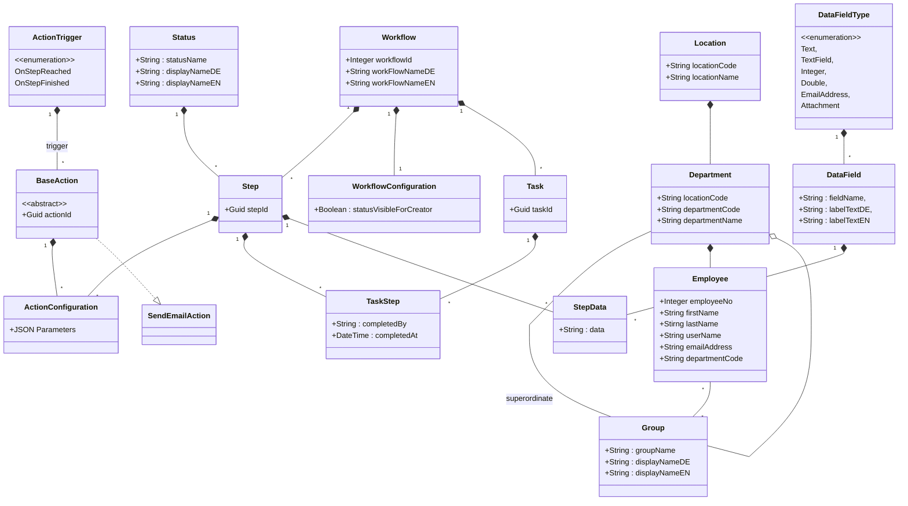

# Datenmodell

```mermaid
classDiagram
    Location *-- Department
    Department --o Department : superordinate
    Department *-- Employee

    class Location
    Location : +String locationCode
    Location : +String locationName

    class Department
    Department : +String locationCode
    Department : +String departmentCode
    Department : +String departmentName

    class Employee
    Employee : +Integer employeeNo
    Employee : +String firstName
    Employee : +Stirng lastName
    Employee : +String userName
    Employee : +String emailAddress
    Employee : +String departmentCode

    class Group {
        +String : groupName
        +String : displayNameDE
        +String : displayNameEN
    }

    Employee "*" -- "*" Group

    class Workflow
    Workflow : +Integer workflowId
    Workflow : +String workFlowNameDE
    Workflow : +String workFlowNameEN

    Workflow "1" *-- "*" Step

    class WorkflowConfiguration {
        +Boolean : statusVisibleForCreator

    }

    Workflow "1" *-- "1" WorkflowConfiguration

    class Status {
        +String : statusName
        +String : displayNameDE
        +String : displayNameEN
    }

    class Step {
        +Guid stepId
    }

    Status "1" *-- "*" Step

    class ActionTrigger {
        &lt;&lt;enumeration&gt;&gt;
        OnStepReached
        OnStepFinished
    }

    ActionTrigger "1" *-- "*" BaseAction : trigger

    class BaseAction {
        &lt;&lt;abstract&gt;&gt;
    }
    BaseAction : +Guid actionId

    class ActionConfiguration
    ActionConfiguration : +JSON Parameters
    
    Step "1" *-- "*" ActionConfiguration
    BaseAction "1" *-- "*" ActionConfiguration

    class SendEmailAction
    
    BaseAction ..|> SendEmailAction

    class Task {
        +Guid taskId
    }

    Workflow "1" *-- "*" Task

    class TaskStep {
        +String : completedBy
        +DateTime : completedAt
    }

    Task "1" *-- "*" TaskStep
    Step "1" *-- "*" TaskStep

    class DataFieldType {
        &lt;&lt;enumeration&gt;&gt;
        Text,
        TextField,
        Integer,
        Double,
        EmailAddress,
        Attachment
    }

    class DataField {
        +String : fieldName,
        +String : labelTextDE,
        +String : labelTextEN
    }

    DataFieldType "1" *-- "*" DataField

    class StepData {
        +String : data
    }

    Step "1" *-- "*" StepData
    DataField "1" *-- "*" StepData
```